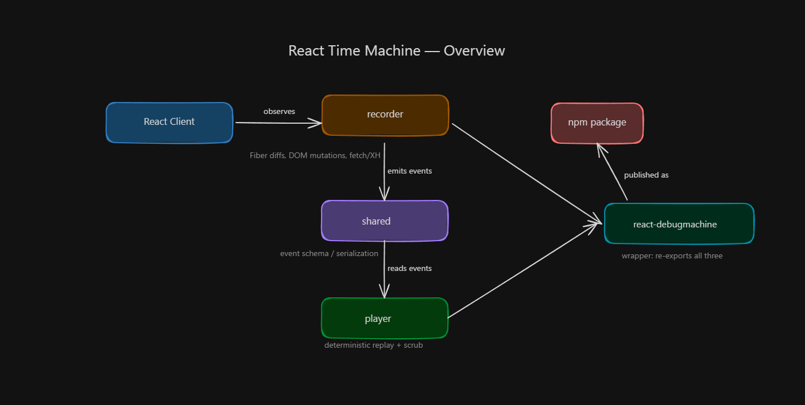

# React Time Machine

Records every state change, DOM mutation, and network request in a React app, then replays it deterministically.


Published on npm as a single wrapper package plus its underlying pieces, all scoped to `@henriquecosta`, my npm username:

- [`@henriquecosta/react-debugmachine`](https://www.npmjs.com/package/@henriquecosta/react-debugmachine) — single-entry-point package, install this one

## Project structure

```
application/        pnpm workspace root — all installable code lives here
  packages/
    shared/               event schema, serialization format
    recorder/             capture agent (Fiber, DOM, network)
    player/                deterministic replay engine
    react-debugmachine/   wrapper package re-exporting recorder + player + shared
  apps/
    demo/                 sample React app used to dogfood the recorder
scripts/           bootstrap.ps1/.sh, publish.ps1/.sh — see below
docs/              architecture, design, changelog
deployment/        CI + hosting config
```

## Quick start (development)

```bash
git clone "git@github.com:HenriqueCosta05/React-TimeMachine.git"
./scripts/bootstrap.ps1        # or ./scripts/bootstrap.sh
cd application
pnpm dev                       # runs apps/demo with recorder attached
```

Or, to use the published package in your own app:

```bash
npm install @henriquecosta/react-debugmachine
```

```ts
import { Recorder, Player } from "@henriquecosta/react-debugmachine";
```

See [docs/EXAMPLES.md](docs/EXAMPLES.md) for a full record → store → replay → scrub walkthrough against a realistic checkout flow.

## Prerequisites

- Node 20+
- pnpm 9+ (bootstrap script installs it if missing)

## Scripts

- `scripts/bootstrap.ps1` / `scripts/bootstrap.sh` — install pnpm if missing, install workspace deps, build the wrapper package
- `scripts/publish.ps1` / `scripts/publish.sh` — typecheck/test/build the wrapper package (and its workspace dependencies), bump its version, publish to npm. See [application/README.md](application/README.md) for details.

## Where to look next

- Usage examples (real-world recording/replay flow): [docs/EXAMPLES.md](docs/EXAMPLES.md)
- Development and publishing workflow: [application/README.md](application/README.md)
- Architecture and design decisions: [docs/DESIGN.md](docs/DESIGN.md)
- Changelog: [docs/CHANGELOG.md](docs/CHANGELOG.md)
- Deployment: [docs/deployment/README.md](docs/deployment/README.md)
