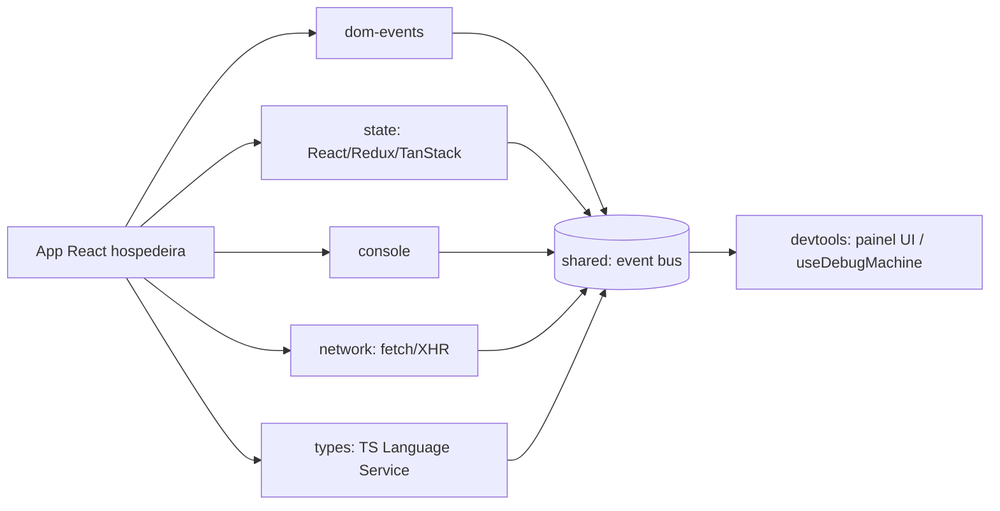

# Convenções de Arquitetura e Código — React Debug Machine

| Campo | Valor |
|---|---|
| Projeto | React Debug Machine |
| Versão do documento | 2.0 |
| Última atualização | 2026-07-23 |
| Responsável | Henrique Costa |
| Status | `final` |

---

## 1. Tecnologias (stack)

### 1.1 Visão geral

| Camada | Tecnologia | Versão | Por que foi escolhida |
|---|---|---|---|
| Linguagem | TypeScript | 5.x | Tipagem estrita necessária para introspeccionar estado/eventos com segurança |
| Runtime / plataforma | Browser (client-side) | — | Instrumentação roda dentro da app hospedeira, não em servidor |
| Framework de UI (peer) | React | 18.x / 19.x | Público-alvo é apps React; fiber shape difere entre 18 e 19, ambos suportados |
| Gerência de estado (alvo de captura) | Indiferente - React + Qualquer Lib | — | -- |
| Estilização (painel `devtools`) | Material UI + Styled Components | — | Painel dense/dark, ver docs/DESIGN.md |
| Build / bundler | rsbuild | — | Reaproveita convenção anterior do projeto para apps de demonstração e apresenta diferenças de performance em relação ao vite ou outros bundlers. |
| Roteamento | N/A | — | Não é uma aplicação com rotas |
| Camada de dados / API | N/A | — | Produto não tem backend próprio |
| Persistência | In-memory (sessão do navegador) | — | Dados capturados nunca saem do navegador nem persistem entre sessões, por padrão |
| Testes | Vitest (+ Playwright para cenários que exigem browser real) | — | Vitest para lógica isolada; Playwright para captura de DOM/rede/replay ponta-a-ponta |
| Lint / format | EsLint + Prettier | — | — |
| CI/CD | Github Actions (Publish npm + lint) | — | — |
| Observabilidade | N/A no produto em si | — | O produto é a ferramenta de observabilidade de outra app |

### 1.2 Política de versões e dependências

- Gerenciador de pacotes obrigatório: `pnpm` — lockfile é versionado e nunca regenerado sem justificativa.
- Estratégia de atualização: a definir.
- Critérios para adicionar uma nova dependência:
  1. Resolve um problema real que já apareceu, não um hipotético.
  2. Manutenção ativa nos últimos meses.
  3. Custo de bundle aceitável — cada pacote/adapter tem orçamento próprio (ver PRD §1.5).
  4. Existe caminho de saída (é substituível sem reescrever o domínio).
- Dependências proibidas / desencorajadas: nenhuma dependência que exija telemetria/rede externa — o produto nunca envia dados capturados para fora do navegador.

### 1.3 Ambiente de desenvolvimento

| Item | Definição |
|---|---|
| OS suportado | Windows (ambiente primário), com scripts `.ps1`/`.sh` equivalentes para Linux/macOS |
| Versão de runtime | a fixar em `.nvmrc` quando o workspace for recriado |
| Variáveis de ambiente | Não previstas — ferramenta 100% client-side, sem configuração de ambiente sensível |
| Comandos essenciais | `pnpm install` · `pnpm dev` · `pnpm test` · `pnpm build` · `pnpm typecheck` |

---

## 2. Filosofia de código

### 2.1 Princípios inegociáveis

1. **Clareza acima de esperteza** — código de instrumentação já é difícil de ler por natureza (hooks em internals, patches de globais); não piorar isso com abstração desnecessária.
2. **Reversibilidade de patches globais** — qualquer patch em `console`, `fetch`, `XMLHttpRequest` ou fiber precisa de um caminho de restore explícito; nunca é permanente.
3. **Simples agora, extensível depois** — evitar abstração compartilhada entre adapters antes do terceiro caso real de reuso.
4. **Adapter é opcional e isolado** — cada adapter (dom-events, state, console, network, types) funciona de forma independente; a ausência de um não quebra os demais.
5. **Sem estado global sem justificativa** — o event bus em `shared` é a única fonte compartilhada; adapters não guardam estado próprio além do necessário para capturar/repetir.

### 2.2 Regras práticas

| Tema | Regra | Exceção aceita |
|---|---|---|
| Tamanho de arquivo | ≤ 300 linhas; acima disso, dividir | — |
| Tamanho de função | ≤ 40 linhas / 1 responsabilidade | — |
| Aninhamento | máx. 3 níveis; usar early return | — |
| Comentários | explicam o *porquê*, nunca o *o quê* | — |
| Tipagem | `any` proibido; `unknown` + narrowing — especialmente relevante aqui, já que o produto introspecciona valores de shape arbitrário (estado da app hospedeira) | — |
| Mutabilidade | dados imutáveis por padrão | eventos capturados são snapshots — nunca mutados após captura |
| Tratamento de erro | sem `catch` silencioso | um adapter que falha ao capturar não deve derrubar a app hospedeira — falha isolada, reportada, não engolida |
| Código morto | removido, não comentado — o histórico está no Git | — |

### 2.3 Convenções de nomenclatura

| Elemento | Padrão | Exemplo |
|---|---|---|
| Arquivos de componente | PascalCase | `EventList.tsx` |
| Arquivos utilitários | camelCase | `formatDiff.ts` |
| Diretórios | "object-based" - em vez de usar um nome composto, criar um arquivo e uma pasta | `dom/events.ts` |
| Constantes | SCREAMING_SNAKE_CASE | `MAX_TIMELINE_EVENTS` |
| Tipos / interfaces | PascalCase, sem prefixo `I` | `DebugEvent` |
| Booleanos | prefixo `is`/`has`/`should` | `isRecording` |
| Handlers | `handleX` local, `onX` prop | `handleSeek` |
| Pacotes npm | `@henriquecosta/react-debugmachine-<pacote>` | `@<henriquecosta>/react-debugmachine-network` |
| Idioma do código | inglês para código e commits; português para docs internas | — |

> Scope npm definitivo ainda em aberto (Q-01 no PRD) — placeholder `<scope>` até ser decidido.

### 2.4 Estrutura de diretórios

```
/
    /docs
        -- CONVENTIONS.md
        -- DESIGN.md
        -- PRD.md
        -- CHANGELOG.md
    /scripts
        -- bootstrap/
            -- bootstrap.ps1
            -- bootstrap.sh
        -- publish/
            -- publish.ps1
            -- publish.sh
    /application
        /packages
            /shared              # schema de eventos, event bus, modelo de timeline/sessão
            /dom-events          # captura + replay de eventos DOM/sintéticos do React
            /state                # adapters React state / Redux / TanStack
            /console             # interceptação de console.* (só captura, sem replay)
            /network             # fetch + XHR — captura + replay
            /types                # integração com TS Language Service (só captura, sem replay)
            /devtools            # painel UI + hook useDebugMachine
            /react-debugmachine  # wrapper opcional
        /demos
            /demo                # app mínimo, dogfood de captura crua
            /complex-demo        # app mock, dogfood do painel devtools completo

    README.md
    TODO.md
```

Regras de import:
- Imports cruzados profundos (`../../..`) são proibidos; usar alias `@/` dentro de cada pacote.
- Cada pacote expõe somente o que está em seu `index.ts`.

### 2.5 Testes

| Tipo | Escopo | Ferramenta | Meta |
|---|---|---|---|
| Unitário | Lógica pura de cada adapter (parsing, diff, schema) | Vitest | Cobrir toda transformação de evento |
| Integração | Adapter + DOM/estado simulado (jsdom) | Vitest + jsdom | Cobrir fluxo captura → evento no bus |
| E2E | Captura/replay ponta-a-ponta em app real (DOM, network, replay) | Playwright | Cobrir cenário de captura + replay determinístico |

- O que **sempre** exige teste: lógica de diff de estado, replay de mutações de DOM (posição/ordem), interceptação de rede (fetch e XHR), qualquer bug corrigido (teste de regressão).
- O que **não** exige: markup estático do painel, wrappers triviais.
- Testes descrevem comportamento, não implementação: `deve reproduzir remoção de nó no meio da lista na mesma posição original`.
- `types` (Language Service real) provavelmente não é testável isoladamente em jsdom — validar em Playwright ou ambiente Node com TS real.

### 2.6 Git e revisão

- Branches: `main` protegida; `feat|fix|chore/descricao-curta`.
- Commits: Conventional Commits — `feat(network): adiciona interceptação de XHR`.
- PR: descrição com contexto + como testar, 1 aprovação mínima.
- Merge: squash.
- Checklist de review:
  - [ ] Segue esta convenção
  - [ ] Testes cobrem o comportamento novo
  - [ ] Documentação atualizada no mesmo PR
  - [ ] Sem segredos, sem `console.log` de debug esquecido, sem TODO órfão

---

## 3. Princípios de System design

### 3.1 Atributos de qualidade priorizados

| # | Atributo | Meta mensurável | Trade-off aceito |
|---|---|---|---|
| 1 | Performance (overhead de instrumentação) | Overhead desprezível com instrumentação desligada; meta ativa a definir via benchmark | Menos captura "por garantia", mais captura sob demanda |
| 2 | Manutenibilidade | Cada adapter isolado e testável sozinho | Mais boilerplate de schema compartilhado em `shared` |
| 3 | Confiabilidade | Falha de um adapter nunca derruba a app hospedeira | Erros de captura são reportados, não lançados |
| 4 | Segurança / privacidade | Zero dados saindo do navegador | Sem telemetria de uso do próprio produto |

### 3.2 Princípios estruturais

1. **Fronteiras por feature, não por camada** — cada uma das 5 capacidades é um pacote independente; a UI (`devtools`) é a única camada que conhece todos os adapters.
2. **Dependências apontam para dentro** — `devtools` depende dos adapters; nenhum adapter depende de `devtools`.
3. **Fonte única da verdade** — o event bus em `shared` é o único canal de eventos capturados; adapters publicam, nunca leem de volta.
4. **Contratos explícitos nas bordas** — todo evento publicado no bus segue o schema definido em `shared`, validado no ponto de publicação.
5. **Falha isolada** — um adapter que quebra (ex.: `types` sem Language Service disponível) degrada silenciosamente, não derruba os outros 4.
6. **Reversibilidade** — qualquer patch de objeto global tem função de restore; desligar a instrumentação devolve o app ao estado original.
7. **Observabilidade desde o dia 1** — mesmo sendo uma ferramenta de observabilidade, ela própria não se auto-monitora com telemetria externa; only local, in-memory.

### 3.3 Contexto do sistema



| Integração | Tipo | Protocolo | Falha esperada | Estratégia |
|---|---|---|---|---|
| React fiber (state/dom) | Introspecção interna | API interna do React | Internals mudam entre versões | Shim por versão de React, faixa suportada explícita |
| TypeScript Language Service | Chamada local | API do compilador TS | Custo/latência alto no browser | Validar viabilidade antes do M5 (ver PRD RK-02) |

### 3.4 Concerns transversais

| Concern | Definição para este projeto |
|---|---|
| Autenticação / autorização | N/A — ferramenta local, sem backend |
| Gestão de erros | Erro em um adapter é capturado e reportado no painel como "adapter indisponível"; nunca propaga para a app hospedeira |
| Logging e telemetria | Nunca há envio externo; tudo fica local/in-memory na sessão do navegador |
| Configuração | Instrumentação configurada via props/opções no ponto de instalação de cada adapter; sem arquivo de config externo |
| Cache e invalidação | N/A |
| Internacionalização | Não prioritário nesta fase |
| Acessibilidade | Painel `devtools` alvo WCAG 2.1 AA |
| Segurança | Nenhum dado capturado sai do navegador; sem CSP especial exigido pelo produto em si |
| Performance | Orçamento de bundle por pacote (ver PRD §1.5); code splitting não aplicável (pacotes já são pequenos e independentes) |

### 3.5 Restrições (constraints)

| Restrição | Origem | Negociável? |
|---|---|---|
| Deve rodar 100% client-side, sem backend próprio | Produto | Não |
| Nunca envia dados capturados para fora do navegador | Produto/privacidade | Não |
| Suporta React 18 e 19 | Compatibilidade | Sim, com ADR, se suporte a versão antiga for descontinuado |

### 3.6 Registro de decisões (ADR)

| ID | Decisão | Status | Data |
|---|---|---|---|
| ADR-001 | Split de pacotes por feature (um pacote por capacidade) em vez de monólito ou split por record/replay | aceita | 2026-07-23 |
| ADR-002 | Como o TS Language Service roda no browser para viabilizar `types` (R-05) | proposta | — |

### 3.7 Anti-padrões proibidos neste projeto

- Lógica de captura/replay dentro de componente de UI do painel `devtools`.
- Abstração compartilhada entre adapters criada para um único caso de uso.
- Patch de objeto global (`console`, `fetch`, `XMLHttpRequest`) sem caminho de restore.
- Try/catch que engole erro de um adapter sem reportar no painel.
- Qualquer chamada de rede saindo do produto para fora do navegador (telemetria, analytics).

### 3.8 Dívida técnica conhecida

| Item | Impacto | Custo estimado | Gatilho para pagar |
|---|---|---|---|
| — | — | — | Projeto reiniciado do zero — nenhuma dívida técnica ainda |

---

## 4. Glossário

| Termo | Definição |
|---|---|
| Adapter | Módulo que captura (e, quando aplicável, repete) uma das 5 capacidades de debug |
| Event bus | Canal compartilhado em `shared` onde adapters publicam eventos |
| Fiber | Estrutura interna do React usada para introspecção de estado/componentes |
| Language Service | API do TypeScript usada para obter diagnósticos de tipo |

## 5. Referências

- Documentos internos: [docs/PRD.md](PRD.md), [docs/DESIGN.md](DESIGN.md), [TODO.md](../TODO.md)

## 6. Changelog do documento

| Data | Versão | Mudança | Autor |
|---|---|---|---|
| 2026-07-23 | 1.0 | Versão inicial | Henrique Costa |
